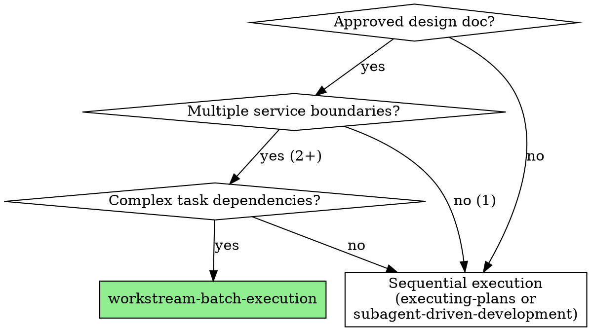

# Workstream-Batch Execution

## Overview

Execute large implementation plans by mapping service boundaries to isolated workstreams, modeling task dependencies into batches and waves, and orchestrating parallel agent work with merge points.

**Core principle:** Explicit specification of what can run in parallel, what must be sequential, and where parallel work converges = safe, scalable parallelism across 5-10+ subagents.

**Execution model:** Everything runs in a **single Claude Code session**. The controller (you) orchestrates by dispatching subagents via the Task tool. Subagents work in parallel across isolated worktrees. The controller manages state, coordinates merge points, and captures learnings.

**Announce at start:** "I'm using the workstream-batch-execution skill to orchestrate this implementation."

## When to Use



**Use when:**
- Design doc approved with multiple service boundaries (2+ independent services/modules)
- Tasks have complex dependencies (parallel work, sequential work, convergence points)
- Need to coordinate 5-10+ parallel subagents without conflicts
- Large implementation requiring orchestration (not just sequential execution)

**Don't use when:**
- Single service/module (use superpowers:subagent-driven-development)
- Simple linear dependencies (use superpowers:executing-plans)
- Design not approved yet (use superpowers:brainstorming first)
- All tasks tightly coupled (no parallelization possible)

## Quick Reference

| Element | Definition | Example |
|---------|-----------|---------|
| **Workstream (WS-<ID>)** | Independent service boundary | WS-A: Auth Service, WS-B: API Gateway |
| **Batch** | Group of tasks at same dependency level (run in parallel) | Batch 1: A1, B1, E1 |
| **Wave** | Sequence of batches between two merge points | Wave 1: [Batch 1 → Batch 2] → MP1 |
| **Merge Point (MP)** | Convergence where parallel work integrates | MP1: A3 + B2 → unlocks C1 |
| **Task ID** | Workstream letter + sequence number | A1 = first task in WS-A |
| **Controller** | You (single session) - orchestrates subagents | Dispatches, reviews, tracks state |
| **Subagent** | Dispatched worker (via Task tool) - implements one task | Works in assigned worktree |

## The Five-Phase Process

### Phase 1: Workstream Decomposition

**Goal:** Map service boundaries to isolated workstreams.

**Process:**

1. **Identify service boundaries** from design doc
   - Each service/module/component that can be developed independently
   - Clear interfaces/contracts between boundaries
   - Minimal shared state

2. **Assign workstream IDs** (WS-A, WS-B, WS-C...)
   - Use letters for easy reference
   - Document what each workstream owns

3. **Create worktrees** for each workstream
   - **REQUIRED SUB-SKILL:** Use superpowers:using-git-worktrees for each WS
   - Pattern: `.worktrees/WS-A`, `.worktrees/WS-B`, etc.
   - Each worktree = isolated workspace for that service boundary

**Example:**

```markdown
## Workstream Decomposition

**WS-A: Authentication Service**
- Handles user auth, sessions, tokens
- Files: `services/auth/*`, `tests/auth/*`
- Worktree: `.worktrees/WS-A`

**WS-B: API Gateway**
- Routes requests, rate limiting, validation
- Files: `services/gateway/*`, `tests/gateway/*`
- Worktree: `.worktrees/WS-B`

**WS-C: Integration Layer**
- Connects A+B, end-to-end flows
- Files: `services/integration/*`, `tests/integration/*`
- Worktree: `.worktrees/WS-C`
```

### Phase 2: Task Extraction and Dependency Modeling

**Goal:** Break workstreams into tasks and model dependencies.

**Process:**

1. **Extract tasks from design doc/plan**
   - Each task is actionable unit (2-5 minutes per step as per writing-plans)
   - Assign task IDs: `<WS-Letter><Number>` (A1, A2, B1, B2...)
   - Document each task with full tracking metadata (see below)

2. **Document task tracking metadata**

   Every task must have:
   - **Task ID:** WS-Letter + Number (e.g., A1, B3)
   - **Spec:** What needs to be done (from implementation plan)
   - **Acceptance Criteria:** How to verify it's done correctly
   - **Status:** ⏳ Pending → 🔄 Active → ✅ Done (or 🚫 Blocked)
   - **Assigned Subagent:** Which dispatched subagent is working on it
   - **Dependencies:** Which tasks must complete before this one starts
   - **Verification:** Exact commands/tests to run before marking done

   ```markdown
   ### Task A3: Auth Middleware
   - **Spec:** Create JWT validation middleware for Express routes
   - **Acceptance:** `pytest tests/auth/test_middleware.py` passes, covers token expiry + invalid token
   - **Status:** ⏳ Pending
   - **Dependencies:** A1 (data models), A2 (API endpoints)
   - **Verification:** All tests green + integration test with B2
   ```

3. **Model dependencies**
   - **Parallel:** Tasks with no dependencies (can run simultaneously)
   - **Sequential:** Task B blocked by Task A (A must complete first)
   - **Convergence:** Multiple tasks must complete before next unlocks

3. **Create batch groups**
   - Batch = all tasks at same dependency level
   - Tasks in same batch CAN run in parallel
   - Batches run sequentially (Batch 2 waits for Batch 1)

4. **Identify merge points**
   - Points where parallel work must integrate
   - Code review + integration testing required
   - Blocks downstream work until merged

**Example:**

```markdown
## Task Dependencies

### Batch 1 (Parallel - no dependencies)
- **A1:** Auth service data models
- **A2:** Auth API endpoints
- **B1:** Gateway routing logic
- **E1:** Shared types/interfaces

### Batch 2 (Blocked on Batch 1)
- **A3:** Auth middleware (needs A1, A2)
- **B2:** Rate limiting (needs B1)

### Merge Point MP1
- **Trigger:** A3 + B2 complete
- **Action:** Integration test auth → gateway flow
- **Unlocks:** C1

### Batch 3 (Blocked on MP1)
- **C1:** End-to-end auth flow (needs MP1)

## Wave Structure

Wave 1: Foundation (Batches 1-2)
  ├─ Batch 1: A1, A2, B1, E1 (parallel)
  └─ Batch 2: A3, B2 (parallel, blocked on Batch 1)

Merge Point MP1: Integration test auth → gateway

Wave 2: Integration (Batch 3)
  └─ Batch 3: C1 (blocked on MP1)
```

### Phase 3: Dashboard Setup

**Goal:** Create visual tracking for execution state.

**Process:**

1. **Create dashboard file** in project root or docs/
   - `EXECUTION-DASHBOARD.md` or similar
   - ASCII format for easy updates

2. **Initialize with structure** (see template below)
   - Batch status (✅ Done, 🔄 Active, ⏸️ Blocked, ⏳ Runnable)
   - Task status per workstream
   - Merge point tracking
   - Critical path visualization

3. **Update after each task/batch** completion
   - Keep state visible and accurate
   - Helps identify bottlenecks

**Template:** See dashboard-template.md in this directory.

### Phase 4: Batch Execution

**Goal:** Execute tasks with optimal parallelization.

**Execution model:** All work runs in a **single Claude Code session**. You are the **controller**. You dispatch **subagents** (via the Task tool) to do the actual implementation. Subagents run in parallel, each in its own worktree. You coordinate, review, and manage state.

```
┌──────────────────────────────────────────────────────────┐
│  Controller (You - Single Claude Code Session)           │
│                                                          │
│  ┌─────────┐  ┌─────────┐  ┌─────────┐                 │
│  │Subagent 1│  │Subagent 2│  │Subagent 3│  (parallel)   │
│  │WS-A task │  │WS-B task │  │WS-E task │               │
│  │.worktrees│  │.worktrees│  │.worktrees│               │
│  │  /WS-A   │  │  /WS-B   │  │  /WS-E   │               │
│  └─────────┘  └─────────┘  └─────────┘                 │
│                                                          │
│  Controller: update dashboard, check merge points,       │
│  capture learnings, dispatch next batch                   │
└──────────────────────────────────────────────────────────┘
```

**Process:**

For each batch (in order):

1. **Identify runnable tasks** in current batch
   - All dependencies met?
   - Merge points cleared?
   - Update dashboard: mark tasks 🔄 Active

2. **Decide execution strategy:**

   **If all tasks in batch are independent (most common):**
   - **REQUIRED SUB-SKILL:** Use superpowers:dispatching-parallel-agents
   - Dispatch one subagent per task via Task tool, all in parallel
   - Each subagent works in its assigned worktree
   - All subagents run simultaneously within this single session

   **If tasks have subtle dependencies or need review between:**
   - **REQUIRED SUB-SKILL:** Use superpowers:subagent-driven-development
   - Dispatch subagents sequentially with review checkpoints

3. **For each subagent task:**
   - Subagent works in assigned worktree (e.g., `.worktrees/WS-A`)
   - Follows TDD (superpowers:test-driven-development)
   - Runs verification commands specified in task metadata
   - Commits to worktree's branch
   - Returns summary of what was done + verification results

4. **Controller reviews subagent results:**
   - Read each subagent summary
   - Verify reported tests actually pass
   - Check for cross-worktree conflicts
   - Update dashboard: mark tasks ✅ Done

5. **At merge points:**
   - **REQUIRED SUB-SKILL:** Use superpowers:requesting-code-review
   - Controller merges branches from multiple worktrees
   - Run integration tests across workstreams
   - Resolve conflicts if any
   - Mark merge point complete on dashboard

6. **Verify batch complete:**
   - All tasks in batch ✅ with verification passing?
   - All merge points cleared?
   - Run cross-workstream tests if applicable

7. **Proceed to next batch**

**Critical rules:**
- Never start batch N+1 until batch N is 100% complete AND verified
- Never skip merge points (integration issues compound)
- Never dispatch parallel subagents that touch same files
- Task marked ✅ ONLY after verification passes (tests green, review approved)
- If verification fails: task stays 🔄 Active, all downstream stays ⏸️ Blocked
- Controller must review every subagent result before marking done

### Phase 5: Learning Capture

**Goal:** Feed insights back into project documentation.

**Process:**

1. **After each batch or at merge points, capture:**
   - What went wrong (specs wrong, assumptions broken, unclear requirements)
   - What worked well (patterns to repeat)
   - What needs tightening (ambiguous instructions, missing context)

2. **Update CLAUDE.md** with learnings
   - Common mistakes section
   - Clarifications for future agents
   - Project-specific patterns that emerged

3. **Update execution plan if needed**
   - Adjust remaining batches based on learnings
   - Revise task dependencies if assumptions changed

**Example:**

```markdown
## Captured in CLAUDE.md after Batch 1:

### Common Mistakes
- Auth tokens: Use JWT format (not sessions) - emerged from A2 implementation
- Rate limiting: Apply per-endpoint not globally - B1 initially wrong

### Patterns
- Always validate interfaces at workstream boundaries - caught issues at MP1
```

## Dashboard Template

Create `EXECUTION-DASHBOARD.md` in your project:

```markdown
# Execution Dashboard

**Updated:** [timestamp]

## Workstream Status

| WS | Name | Branch | Status | Tasks Complete |
|----|------|--------|--------|----------------|
| A | Auth Service | `.worktrees/WS-A` | 🔄 Active | 3/8 |
| B | API Gateway | `.worktrees/WS-B` | ✅ Done | 3/3 |
| C | Integration | `.worktrees/WS-C` | ⏸️ Blocked (MP1) | 0/2 |

## Batch Progress

```
Legend: ✅ Done  🔄 Active  ⏸️ Blocked  ⏳ Runnable

Batch 1: ✅ DONE
  A1 ✅  Auth models
  A2 ✅  Auth endpoints
  B1 ✅  Gateway routing
  E1 ✅  Shared types

Batch 2: ✅ DONE
  A3 ✅  Auth middleware
  B2 ✅  Rate limiting

Merge Point MP1: ✅ DONE
  ✅ Integration test: auth → gateway
  ✅ Code review passed
  → Unlocked: C1

Batch 3: 🔄 ACTIVE
  C1 🔄  End-to-end flow (in progress)

Batch 4: ⏸️ BLOCKED (waiting on Batch 3)
  A4 ⏸️  Token refresh
  B3 ⏸️  Error handling

Merge Point MP2: ⏸️ BLOCKED (waiting on A4 + B3)
  ⏸️ Full integration test
  → Will unlock: Batch 5
```

## Critical Path

```
A1 → A2 → A3 → [MP1] → C1 → [Batch 4] → A4 → [MP2] → Final Integration
```

Current bottleneck: **C1** (end-to-end flow implementation)
```

## Integration with Existing Skills

This skill orchestrates other superpowers skills:

| Phase | Calls Skill |
|-------|-------------|
| **Workstream Decomposition** | superpowers:using-git-worktrees (per workstream) |
| **Parallel Batches** | superpowers:dispatching-parallel-agents |
| **Sequential Batches** | superpowers:subagent-driven-development |
| **Merge Points** | superpowers:requesting-code-review |
| **Final Integration** | superpowers:finishing-a-development-branch |
| **Each Task** | superpowers:test-driven-development (via subagents) |
| **Before Starting** | superpowers:brainstorming (design/planning) |
| **Verification** | superpowers:verification-before-completion |

## Common Mistakes

### ❌ Starting parallel work without workstream isolation
- **Problem:** Agents conflict on same files, merge chaos
- **Fix:** Always create separate worktrees per workstream first

### ❌ Skipping merge points
- **Problem:** Integration issues compound, final merge is nightmare
- **Fix:** Review and test at EVERY merge point, never skip

### ❌ Dispatching dependent tasks in parallel
- **Problem:** Task B starts before Task A completes, fails or duplicates work
- **Fix:** Model dependencies correctly, batch only truly independent tasks

### ❌ No dashboard = lost in complexity
- **Problem:** Can't tell what's blocked, what's runnable, where bottlenecks are
- **Fix:** Update dashboard after every task, make state visible

### ❌ Ignoring learning feedback
- **Problem:** Same mistakes repeat across workstreams
- **Fix:** Capture learnings to CLAUDE.md immediately, propagate to other agents

### ❌ Optimistic dependency modeling
- **Problem:** "These seem independent" → discover hidden dependency mid-execution
- **Fix:** Conservative batching (when unsure, sequential first batch, parallelize later batches)

## Red Flags - STOP and Reconsider

**Never:**
- Start parallel agents without workstream isolation (use worktrees)
- Skip merge point reviews ("we'll test at the end")
- Proceed to next batch while current batch has incomplete tasks
- Let agents work on overlapping files/code
- Ignore failing tests at batch boundaries
- Skip dashboard updates (state becomes invisible)

**Always:**
- Create worktrees before dispatching agents
- Model dependencies conservatively
- Review at merge points before proceeding
- Update dashboard to maintain visibility
- Capture learnings back to CLAUDE.md
- Verify tests pass before batch completion

## Troubleshooting: When Things Go Wrong

### Task Verification Fails
- **Don't:** Mark task complete anyway
- **Do:** Keep task 🔄 Active, dispatch fix subagent, re-verify, then mark ✅
- **Impact:** All downstream tasks stay ⏸️ Blocked until fixed

### Merge Point Integration Test Fails
- **Don't:** Skip the merge point or merge anyway
- **Do:** Identify which workstream has the issue, dispatch fix subagent to that worktree, re-test
- **Impact:** All downstream batches blocked until MP cleared

### Hidden Dependency Discovered Mid-Batch
- **Don't:** Continue parallel execution
- **Do:** Pause affected subagents, update dependency model, re-sequence remaining batches
- **Update:** Dashboard + implementation plan with corrected dependencies

### Subagent Conflict (Two Subagents Touch Same Files)
- **Don't:** Try to merge conflicting changes
- **Do:** STOP - workstream decomposition was wrong
- **Fix:** Re-decompose workstreams with clearer boundaries, restart affected tasks

## Example: Three-Service Implementation

**Design doc approved:** Build auth service, API gateway, integration layer

**Phase 1: Workstream Decomposition**
```
WS-A: Auth Service → .worktrees/WS-A
WS-B: API Gateway → .worktrees/WS-B
WS-C: Integration → .worktrees/WS-C
```

**Phase 2: Dependency Modeling**
```
Batch 1 (Parallel): A1, A2, B1 - foundation work, all independent
Batch 2 (Parallel): A3, B2 - build on Batch 1, no cross-dependencies
MP1: Integrate A+B, test auth→gateway flow
Batch 3 (Sequential): C1 - needs MP1 complete
```

**Phase 3: Dashboard Setup**
```markdown
EXECUTION-DASHBOARD.md created with 3 workstreams, 3 batches, 1 merge point
```

**Phase 4: Execution**
1. Batch 1: Dispatch 3 parallel agents (A1, A2, B1) via dispatching-parallel-agents
2. All complete → Update dashboard → Batch 1 ✅
3. Batch 2: Dispatch 2 parallel agents (A3, B2)
4. All complete → Update dashboard → Batch 2 ✅
5. MP1: Code review, integration test → MP1 ✅
6. Batch 3: Single agent (C1) via subagent-driven-development
7. Complete → Update dashboard → Batch 3 ✅

**Phase 5: Learning Capture**
```markdown
CLAUDE.md updated:
- Auth tokens must be JWT (discovered in A2)
- Rate limiting per-endpoint not global (B1 initially wrong)
- Integration tests caught interface mismatch at MP1
```

**Result:** 3 workstreams completed with 5 agents working in parallel (3 in Batch 1, 2 in Batch 2, no conflicts, clean integration).
