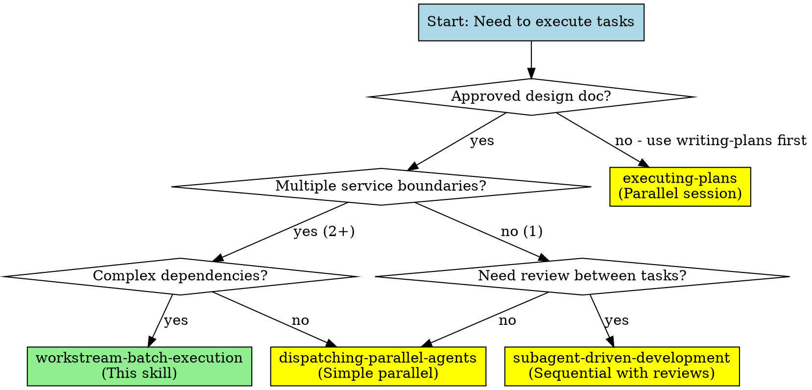

# Workstream-Batch Execution Integration Guide

Quick reference for which skills to call at each phase.

## Complete Workflow: From Idea to Implementation

```
┌─────────────────────────────────────────────────────────────┐
│ STEP 1: superpowers:brainstorming                          │
│ → Brainstorm features, explore approaches                   │
│ → Create design doc with service boundaries                 │
│ → Get user approval on architecture                         │
└─────────────────────────────────────────────────────────────┘
                              ↓
┌─────────────────────────────────────────────────────────────┐
│ STEP 2: superpowers:writing-plans                          │
│ → Write exact implementation plan                           │
│ → Break down into bite-sized tasks (2-5 min each)          │
│ → Document files, commands, expected outputs               │
│ → Save to docs/plans/YYYY-MM-DD-<feature>.md              │
└─────────────────────────────────────────────────────────────┘
                              ↓
┌─────────────────────────────────────────────────────────────┐
│ STEP 3: workstream-batch-execution (THIS SKILL)            │
│ → Decompose plan into workstreams (WS-<ID>)                │
│ → Model dependencies (batches, waves, merge points)        │
│ → Orchestrate parallel agent execution                      │
└─────────────────────────────────────────────────────────────┘
                              ↓
        ┌─────────────────────┴─────────────────────┐
        │                                           │
   Phase 1: Workstream Decomposition               │
        │                                           │
        ↓                                           │
   Per workstream:                                  │
   superpowers:using-git-worktrees                  │
   → Creates isolated workspace                     │
        │                                           │
        ↓                                           │
   Phase 2: Dependency Modeling                     │
   → Create batches, waves, merge points            │
        │                                           │
        ↓                                           │
   Phase 3: Dashboard Setup                         │
   → Use dashboard-template.md                      │
        │                                           │
        ↓                                           │
   Phase 4: Batch Execution ─────────────────────────
        │
        ↓
   For each batch:
        │
        ├─→ If tasks independent:
        │   superpowers:dispatching-parallel-agents
        │   → One agent per task, all run simultaneously
        │
        ├─→ If tasks need review checkpoints:
        │   superpowers:subagent-driven-development
        │   → Sequential with review gates
        │
        ├─→ At merge points:
        │   superpowers:requesting-code-review
        │   → Review integrated changes
        │
        └─→ Each task uses:
            superpowers:test-driven-development
            superpowers:verification-before-completion
        │
        ↓
   Phase 5: Learning Capture
   → Update CLAUDE.md with insights
        │
        ↓
┌─────────────────────────────────────────────────────────────┐
│ AFTER: superpowers:finishing-a-development-branch           │
│ → Final integration, PR creation, cleanup                   │
└─────────────────────────────────────────────────────────────┘
```

## Decision Tree: Which Execution Skill?



## When to Use Each Skill

### Use `superpowers:brainstorming` When:
- Starting a new feature or project
- Exploring different architectural approaches
- Need to identify service boundaries
- Want to discuss trade-offs and design decisions
- **Output:** Design doc with approved architecture and service boundaries

### Use `superpowers:writing-plans` When:
- Design doc is approved
- Ready to create detailed implementation steps
- Need to break work into bite-sized tasks (2-5 min each)
- Want exact commands, file paths, expected outputs documented
- **Output:** Implementation plan at `docs/plans/YYYY-MM-DD-<feature>.md`

### Use `workstream-batch-execution` (This Skill) When:
- Implementation plan exists
- Design has 2+ independent service boundaries
- Tasks have complex dependencies (parallel, sequential, convergence)
- Need to coordinate 5-10+ parallel subagents from a single session
- **Output:** Executed implementation with dashboard tracking

## Phase-by-Phase Skill Calls

### Phase 1: Workstream Decomposition

**For each workstream identified:**

```bash
# Call using-git-worktrees for each workstream
superpowers:using-git-worktrees → Create .worktrees/WS-A
superpowers:using-git-worktrees → Create .worktrees/WS-B
superpowers:using-git-worktrees → Create .worktrees/WS-C
```

**Result:** Isolated workspaces, tests verified

### Phase 2: Dependency Modeling

**No skill calls - pure analysis:**
- Extract tasks from design doc
- Assign task IDs (A1, A2, B1...)
- Model dependencies (parallel/sequential/convergence)
- Group into batches
- Identify merge points

### Phase 3: Dashboard Setup

**No skill calls - create tracking:**
- Copy `dashboard-template.md` to project
- Initialize with workstreams, batches, merge points
- Set initial state (all ⏳ Runnable or ⏸️ Blocked)

### Phase 4: Batch Execution (Single Session, Parallel Subagents)

**You are the controller.** All subagents dispatched from your single session via the Task tool. Subagents work in parallel in their assigned worktrees.

#### Scenario A: All tasks in batch are independent

```
Controller dispatches via superpowers:dispatching-parallel-agents:

  Task(Subagent-1, "Implement A1 in .worktrees/WS-A")  ─┐
  Task(Subagent-2, "Implement A2 in .worktrees/WS-A")   ├─ All run simultaneously
  Task(Subagent-3, "Implement B1 in .worktrees/WS-B")  ─┘

Controller waits → All return → Controller verifies → Updates dashboard
```

**Each subagent automatically uses:**
- `test-driven-development` (write test first)
- `verification-before-completion` (verify before claiming done)

#### Scenario B: Tasks need review checkpoints

```
Controller uses superpowers:subagent-driven-development:

  Dispatch Subagent → Returns → Controller reviews → Dispatch next
  Task A1 → Review → Task A2 → Review → Task A3
```

#### At Merge Points

```
Controller handles merge points directly:

  superpowers:requesting-code-review
    ↓
  Merge branches from multiple worktrees
  Run integration tests
  Verify interfaces/contracts
  Mark merge point complete on dashboard
  Dispatch next batch
```

### Phase 5: Learning Capture

**No skill calls - documentation:**
- Update CLAUDE.md with learnings
- Document patterns discovered
- Note mistakes to avoid
- Clarify ambiguous requirements

### After All Batches Complete

```bash
superpowers:finishing-a-development-branch
  ↓
  Verify all tests pass
  Create PR or merge
  Clean up worktrees
```

## Common Patterns

### Pattern 1: Foundation Batch (Always Parallel)

First batch typically has no dependencies:

```
Batch 1: A1, A2, B1, E1
  ↓
Use: dispatching-parallel-agents
```

### Pattern 2: Integration Batch (Always Sequential)

Tasks that integrate multiple workstreams:

```
Batch N: C1 (depends on A+B integration)
  ↓
Use: subagent-driven-development (needs careful review)
```

### Pattern 3: Refinement Batch (Can Be Parallel)

Independent improvements after core functionality:

```
Batch N: A4, B3, C2 (all independent refinements)
  ↓
Use: dispatching-parallel-agents
```

## Skill Selection Cheat Sheet

| Situation | Use This Skill |
|-----------|---------------|
| Multiple service boundaries with complex deps | `workstream-batch-execution` |
| Single service, need reviews per task | `subagent-driven-development` |
| 3+ independent tasks, no reviews needed | `dispatching-parallel-agents` |
| Separate session, batch execution | `executing-plans` |
| Before any implementation | `brainstorming` |
| Setup isolated workspace | `using-git-worktrees` |
| At convergence points | `requesting-code-review` |
| Every task (via subagents) | `test-driven-development` |
| Before claiming complete | `verification-before-completion` |
| After all work done | `finishing-a-development-branch` |

## Red Flags - Wrong Skill Choice

❌ **Using workstream-batch-execution for single service**
→ Overkill, use `subagent-driven-development` instead

❌ **Using dispatching-parallel-agents with file conflicts**
→ Need workstream isolation, use `workstream-batch-execution`

❌ **Using subagent-driven-development for truly parallel work**
→ Slower, use `dispatching-parallel-agents`

❌ **Starting without approved design**
→ Use `brainstorming` first

❌ **Skipping worktree setup**
→ Subagents will conflict, always use `using-git-worktrees`

## Example: Three-Workstream Project

```
Design: Auth service + API Gateway + Integration layer

1. Decomposition:
   - WS-A (Auth) → using-git-worktrees → .worktrees/WS-A
   - WS-B (Gateway) → using-git-worktrees → .worktrees/WS-B
   - WS-C (Integration) → using-git-worktrees → .worktrees/WS-C

2. Modeling:
   Batch 1: A1, A2, B1 (parallel)
   Batch 2: A3, B2 (parallel)
   MP1: Integration test
   Batch 3: C1 (sequential)

3. Dashboard:
   Copy dashboard-template.md → EXECUTION-DASHBOARD.md

4. Execution (all from single session):
   - Batch 1 → dispatching-parallel-agents (3 subagents)
   - Batch 2 → dispatching-parallel-agents (2 subagents)
   - MP1 → controller runs requesting-code-review
   - Batch 3 → subagent-driven-development (1 subagent, needs review)

5. Learning:
   Update CLAUDE.md with JWT format, rate limiting patterns

6. Finish:
   → finishing-a-development-branch (create PR, cleanup)
```
